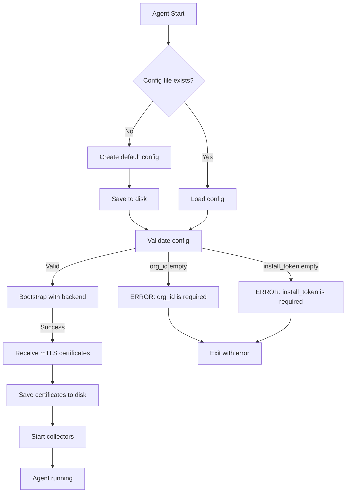

# Hướng Dẫn Cấu Hình Agent Cho Production

## Tổng Quan

Khi cài đặt agent trên máy khách, có **2 cách tiếp cận** để cấu hình `org_id` và `install_token`:

1. **Cách 1: Installer truyền thông tin khi cài đặt** ✅ **RECOMMENDED**
2. **Cách 2: Cấu hình thủ công sau khi cài đặt**

---

## Cách 1: Installer Truyền Thông Tin (Recommended)

### Ưu điểm
- ✅ Tự động hóa hoàn toàn
- ✅ Agent sẵn sàng chạy ngay sau khi cài
- ✅ Giảm thiểu lỗi do nhập sai thông tin
- ✅ Phù hợp cho triển khai hàng loạt (mass deployment)

### Windows (MSI Installer)

#### Cài đặt qua Command Line

```powershell
# Download installer
Invoke-WebRequest -Uri "https://downloads.yourcompany.com/agent/windows/agent-1.0.0.msi" `
  -OutFile "agent.msi"

# Cài đặt với ORG_ID và INSTALL_TOKEN
msiexec /i agent.msi `
  ORG_ID="your-org-id" `
  INSTALL_TOKEN="your-install-token" `
  /quiet /log install.log

# Kiểm tra service đã chạy
Get-Service YourAgentService
```

#### Cài đặt qua GUI

1. Double-click file `agent.msi`
2. Wizard sẽ hiển thị form nhập:
   - **Organization ID**: Nhập org_id của bạn
   - **Install Token**: Nhập install_token
3. Click **Install**
4. Agent tự động khởi động sau khi cài xong

#### Cách hoạt động

File [`agent.wxs`](file:///t:/OWNER_DAT/CODE/OWNER/agent/installers/windows/agent.wxs) định nghĩa:

```xml
<!-- Custom properties for configuration -->
<Property Id="ORG_ID" Secure="yes" />
<Property Id="INSTALL_TOKEN" Secure="yes" />

<!-- Custom action to install service with credentials -->
<CustomAction Id="InstallService" 
              FileKey="AgentExe" 
              ExeCommand='install --org-id "[ORG_ID]" --token "[INSTALL_TOKEN]"' 
              Execute="deferred" 
              Impersonate="no" 
              Return="check" />
```

**Flow:**
1. MSI nhận `ORG_ID` và `INSTALL_TOKEN` từ command line hoặc GUI
2. Copy file `config.template.json` → `C:\ProgramData\unitechio\Agent\config.json`
3. Replace placeholders trong config file:
   - `PLACEHOLDER_ORG_ID` → giá trị thực
   - `PLACEHOLDER_TOKEN` → giá trị thực
4. Chạy `agent.exe install --org-id "..." --token "..."` để đăng ký service
5. Start service

### Linux (DEB/RPM)

#### Debian/Ubuntu (.deb)

```bash
# Download package
wget https://downloads.yourcompany.com/agent/linux/your-agent_1.0.0_amd64.deb

# Cài đặt
sudo dpkg -i your-agent_1.0.0_amd64.deb

# Set environment variables TRƯỚC KHI start service
sudo mkdir -p /etc/systemd/system/your-agent.service.d
cat <<EOF | sudo tee /etc/systemd/system/your-agent.service.d/override.conf
[Service]
Environment="ORG_ID=your-org-id"
Environment="INSTALL_TOKEN=your-install-token"
EOF

# Reload systemd và start
sudo systemctl daemon-reload
sudo systemctl start your-agent
sudo systemctl enable your-agent

# Verify
sudo systemctl status your-agent
```

#### RHEL/CentOS (.rpm)

```bash
# Download package
wget https://downloads.yourcompany.com/agent/linux/your-agent-1.0.0.x86_64.rpm

# Cài đặt
sudo rpm -i your-agent-1.0.0.x86_64.rpm

# Set environment variables
sudo mkdir -p /etc/systemd/system/your-agent.service.d
cat <<EOF | sudo tee /etc/systemd/system/your-agent.service.d/override.conf
[Service]
Environment="ORG_ID=your-org-id"
Environment="INSTALL_TOKEN=your-install-token"
EOF

# Reload và start
sudo systemctl daemon-reload
sudo systemctl start your-agent
sudo systemctl enable your-agent
```

#### Script Installation (Recommended cho Linux)

```bash
# Download và chạy installer script với credentials
curl -sSL https://downloads.yourcompany.com/agent/install.sh | \
  sudo bash -s -- --org-id your-org-id --token your-token

# Hoặc download trước
wget https://downloads.yourcompany.com/agent/install.sh
chmod +x install.sh
sudo ./install.sh --org-id your-org-id --token your-token
```

**Script sẽ:**
1. Detect OS (Ubuntu/Debian/RHEL/CentOS)
2. Download package phù hợp
3. Cài đặt package
4. Tạo config file với credentials
5. Start service

### macOS (.pkg)

```bash
# Download installer
curl -O https://downloads.yourcompany.com/agent/macos/YourAgent-1.0.0.pkg

# Cài đặt (sẽ prompt nhập credentials)
sudo installer -pkg YourAgent-1.0.0.pkg -target /

# Set environment variables trong plist
sudo defaults write /Library/LaunchDaemons/com.yourcompany.agent EnvironmentVariables \
  -dict ORG_ID "your-org-id" INSTALL_TOKEN "your-install-token"

# Start service
sudo launchctl load /Library/LaunchDaemons/com.yourcompany.agent.plist

# Verify
sudo launchctl list | grep com.yourcompany.agent
```

---

## Cách 2: Cấu Hình Thủ Công Sau Khi Cài Đặt

### Ưu điểm
- ✅ Linh hoạt hơn
- ✅ Có thể review config trước khi start
- ✅ Phù hợp cho môi trường test/dev

### Nhược điểm
- ❌ Cần thêm bước manual
- ❌ Dễ bị lỗi do nhập sai
- ❌ Không phù hợp cho triển khai hàng loạt

### Windows

```powershell
# 1. Cài đặt agent (không truyền credentials)
msiexec /i agent.msi /quiet

# 2. Agent sẽ tạo config file mặc định tại:
# C:\ProgramData\unitechio\Agent\config.json

# 3. Edit config file
notepad "C:\ProgramData\unitechio\Agent\config.json"

# 4. Sửa các giá trị:
# {
#   "org_id": "your-org-id",           <- Thay đổi từ ""
#   "install_token": "your-token",     <- Thay đổi từ ""
#   ...
# }

# 5. Start service
Start-Service YourAgentService
```

### Linux

```bash
# 1. Cài đặt package
sudo dpkg -i your-agent_1.0.0_amd64.deb

# 2. Package tạo config template tại /etc/your-agent/config.json
# với org_id và install_token = ""

# 3. Edit config
sudo nano /etc/your-agent/config.json

# 4. Sửa các giá trị:
# {
#   "org_id": "your-org-id",           <- Thay đổi từ ""
#   "install_token": "your-token",     <- Thay đổi từ ""
#   ...
# }

# 5. Start service
sudo systemctl start your-agent
sudo systemctl enable your-agent
```

### macOS

```bash
# 1. Cài đặt package
sudo installer -pkg YourAgent-1.0.0.pkg -target /

# 2. Edit config
sudo nano /var/lib/your-agent/config.json

# 3. Sửa org_id và install_token

# 4. Start service
sudo launchctl load /Library/LaunchDaemons/com.yourcompany.agent.plist
```

---

## Config File Mặc Định

Khi agent chạy lần đầu mà không tìm thấy config file, nó sẽ **tự động tạo** config mặc định:

### Windows: `C:\ProgramData\unitechio\Agent\config.json`

```json
{
  "org_id": "",
  "install_token": "",
  "api_base_url": "https://api.unitechio.com",
  "collection_interval": "60s",
  "batch_size": 100,
  "max_buffer_size": 104857600,
  "buffer_dir": "C:\\ProgramData\\unitechio\\Agent\\buffer",
  "heartbeat_interval": "5m",
  "log_level": "info",
  "log_file": "C:\\ProgramData\\unitechio\\Agent\\logs\\agent.log",
  "update_enabled": true,
  "update_check_interval": "1h",
  "tls": {
    "cert_file": "C:\\ProgramData\\unitechio\\Agent\\certs\\agent.crt",
    "key_file": "C:\\ProgramData\\unitechio\\Agent\\certs\\agent.key",
    "ca_file": "C:\\ProgramData\\unitechio\\Agent\\certs\\ca.crt",
    "insecure_skip_verify": false
  }
}
```

### Linux: `/etc/your-agent/config.json`

```json
{
  "org_id": "",
  "install_token": "",
  "api_base_url": "https://api.unitechio.com",
  "collection_interval": "60s",
  "batch_size": 100,
  "max_buffer_size": 104857600,
  "buffer_dir": "/var/lib/your-agent/buffer",
  "heartbeat_interval": "5m",
  "log_level": "info",
  "log_file": "/var/log/your-agent/agent.log",
  "update_enabled": true,
  "update_check_interval": "1h",
  "tls": {
    "cert_file": "/var/lib/your-agent/certs/agent.crt",
    "key_file": "/var/lib/your-agent/certs/agent.key",
    "ca_file": "/var/lib/your-agent/certs/ca.crt",
    "insecure_skip_verify": false
  }
}
```

### macOS: `/var/lib/your-agent/config.json`

Tương tự Linux.

---

## Flow Hoạt Động Của Agent

### Khi Agent Start Lần Đầu



### Code Reference

File [`config.go`](file:///t:/OWNER_DAT/CODE/OWNER/agent/internal/config/config.go):

```go
// Load reads configuration from a JSON file
func Load(path string) (*Config, error) {
    data, err := os.ReadFile(path)
    if err != nil {
        // If config doesn't exist, create default
        if os.IsNotExist(err) {
            cfg := DefaultConfig()
            if err := cfg.Save(path); err != nil {
                return nil, fmt.Errorf("failed to create default config: %w", err)
            }
            return cfg, nil
        }
        return nil, fmt.Errorf("failed to read config file: %w", err)
    }
    // ... parse and validate
}

// DefaultConfig returns a configuration with sensible defaults
func DefaultConfig() *Config {
    return &Config{
        OrgID:        os.Getenv("ORG_ID"),        // <- Lấy từ env var
        InstallToken: os.Getenv("INSTALL_TOKEN"), // <- Lấy từ env var
        APIBaseURL:   "https://api.unitechio.com",
        // ... other defaults
    }
}

// Validate checks if the configuration is valid
func (c *Config) Validate() error {
    if c.OrgID == "" {
        return fmt.Errorf("org_id is required")
    }
    if c.APIBaseURL == "" {
        return fmt.Errorf("api_base_url is required")
    }
    // ...
}
```

**Quan trọng:**
- `DefaultConfig()` sẽ **tự động lấy** `ORG_ID` và `INSTALL_TOKEN` từ **environment variables**
- Nếu env vars không có, sẽ để trống → validation fail

---

## So Sánh 2 Cách Tiếp Cận

| Tiêu chí | Cách 1: Installer | Cách 2: Manual |
|----------|-------------------|----------------|
| **Tự động hóa** | ✅ Hoàn toàn | ❌ Cần manual |
| **Triển khai hàng loạt** | ✅ Phù hợp | ❌ Không phù hợp |
| **Dễ dàng** | ✅ Một lệnh | ❌ Nhiều bước |
| **Bảo mật** | ✅ Credentials qua CLI | ⚠️ Phải edit file |
| **Linh hoạt** | ⚠️ Ít linh hoạt | ✅ Review được config |
| **Use case** | Production | Dev/Test |

---

## Khuyến Nghị Cho Production

### 1. Windows Enterprise

**Sử dụng Group Policy hoặc SCCM:**

```powershell
# Deploy qua GPO startup script
msiexec /i \\fileserver\agent\agent.msi `
  ORG_ID="acme-corp" `
  INSTALL_TOKEN="xyz123" `
  /quiet /norestart
```

### 2. Linux Fleet

**Sử dụng Ansible/Puppet/Chef:**

```yaml
# Ansible playbook example
- name: Install agent
  apt:
    deb: /tmp/your-agent_1.0.0_amd64.deb
  
- name: Configure agent
  template:
    src: config.json.j2
    dest: /etc/your-agent/config.json
    mode: '0600'
  vars:
    org_id: "{{ vault_org_id }}"
    install_token: "{{ vault_install_token }}"

- name: Start agent
  systemd:
    name: your-agent
    state: started
    enabled: yes
```

### 3. Cloud Deployment (AWS/Azure/GCP)

**Sử dụng User Data / Cloud-Init:**

```bash
#!/bin/bash
# AWS EC2 User Data
curl -sSL https://downloads.yourcompany.com/agent/install.sh | \
  bash -s -- \
    --org-id "acme-corp" \
    --token "$(aws secretsmanager get-secret-value --secret-id agent-token --query SecretString --output text)"
```

---

## Troubleshooting

### Lỗi: "org_id is required"

**Nguyên nhân:**
- Config file có `org_id` = `""`
- Environment variable `ORG_ID` không được set

**Giải pháp:**

```bash
# Option 1: Set env var
export ORG_ID="your-org-id"
export INSTALL_TOKEN="your-token"
go run main.go

# Option 2: Edit config file
nano /etc/your-agent/config.json
# Sửa "org_id": "" thành "org_id": "your-org-id"
```

### Lỗi: "install_token is required for bootstrap"

**Nguyên nhân:**
- Config có `org_id` nhưng thiếu `install_token`

**Giải pháp:**

```bash
# Set install_token trong config hoặc env var
export INSTALL_TOKEN="your-token"
```

### Agent chạy nhưng không connect được backend

**Kiểm tra:**

```bash
# 1. Verify config
cat /etc/your-agent/config.json | jq .

# 2. Check network connectivity
curl -v https://api.unitechio.com/health

# 3. Check logs
sudo journalctl -u your-agent -f
```

---

## Development/Testing

Để test agent locally mà không cần credentials thực:

```bash
# Set dummy credentials
export ORG_ID="test-org"
export INSTALL_TOKEN="test-token"

# Run agent
go run cmd/agent/main.go
```

**Lưu ý:** Agent sẽ fail khi bootstrap với backend vì credentials không hợp lệ, nhưng ít nhất nó sẽ start được và bạn có thể test các phần khác.

---

## Tóm Tắt

✅ **Production:** Dùng **Cách 1** - Installer truyền credentials
- Windows: MSI với properties `ORG_ID` và `INSTALL_TOKEN`
- Linux: Script installer hoặc systemd environment variables
- macOS: PKG với environment variables

✅ **Dev/Test:** Dùng **Cách 2** - Manual config
- Cài agent
- Edit config file
- Start service

✅ **Agent tự động tạo config mặc định** nếu không tìm thấy file
- Lấy `ORG_ID` và `INSTALL_TOKEN` từ environment variables
- Nếu không có → để trống → validation fail

✅ **Fix đã apply:** Directory creation issue đã được fix trong `config.go`
